En este proyecto se utilizo de la biblioteca de node.js

    "bcrypt": "^5.1.1",
    "connect-mongo": "^5.1.0",
    "dotenv": "^16.4.5",
    "express": "^4.19.2",
    "express-handlebars": "^7.1.2",
    "express-session": "^1.18.0",
    "handlebars": "^4.7.8",
    "mongodb": "^6.6.2",
    "mongoose": "^8.3.5",
    "mongoose-paginate-v2": "^1.8.1",
    "nodemailer": "^6.9.14",
    "passport": "^0.7.0",
    "passport-github2": "^0.1.12",
    "passport-local": "^1.0.0",
    "socket.io": "^4.7.5",
    "sweetalert2": "^11.11.0",
    "uuid": "^10.0.0"
    "@faker-js/faker": "^8.4.1",
    

CARACTERISTICAS PRINCIPALES
Este proyecto implementa un sistema de roles con tres tipos de usuarios:

1- Usuario (User): Usuario común que solo puede realizar compras.

2-Administrador (Admin): Usuario con control total sobre:
  -El CRUD de productos.
  -La gestión de usuarios (puede eliminar usuarios inactivos).
  -La capacidad de cambiar roles a otros usuarios.

3-Usuario Premium (Premium): Puede realizar compras y crear productos.

REGISTRO
 -La autenticación de usuarios se maneja con Passport.
 -Los usuarios pueden registrarse utilizando su cuenta de GitHub o crear una cuenta local.
 -Las sesiones permanecen activas mientras el usuario esté conectado.

LOGIN
 -Los tres roles mencionados (User, Admin, Premium) tienen diferentes permisos dentro de la plataforma.
 -Cada usuario accede a funciones específicas según su rol.

PERFIL
-Los usuarios comunes (User) pueden solicitar un cambio de rol a Premium subiendo la documentación       requerida desde el panel de perfil.
 -Proceso de compra
 -Durante el proceso de compra, los productos se añaden al carrito, el cual se mantiene activo incluso si cierras la sesión. Puedes vaciar el carrito si decides no completar la compra.
 -Al finalizar la compra, se genera un ticket con el número de ID de la transacción.
Se envía un correo de confirmación al completar la compra, utilizando Nodemailer.

IMAGENES DEL PROYECTO

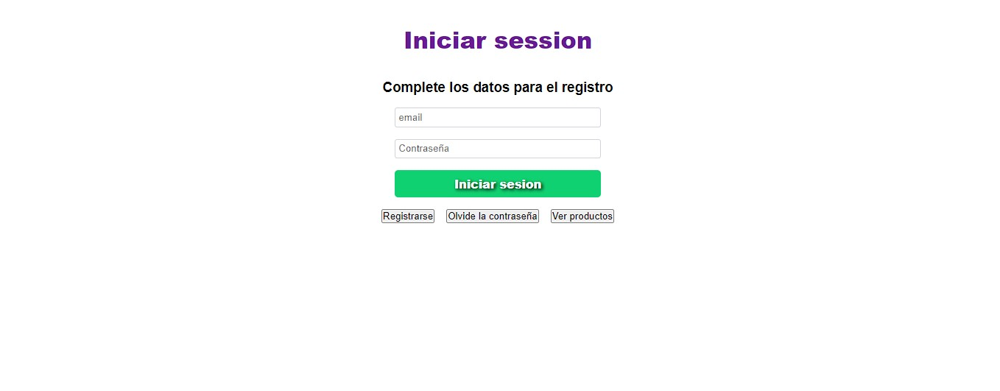

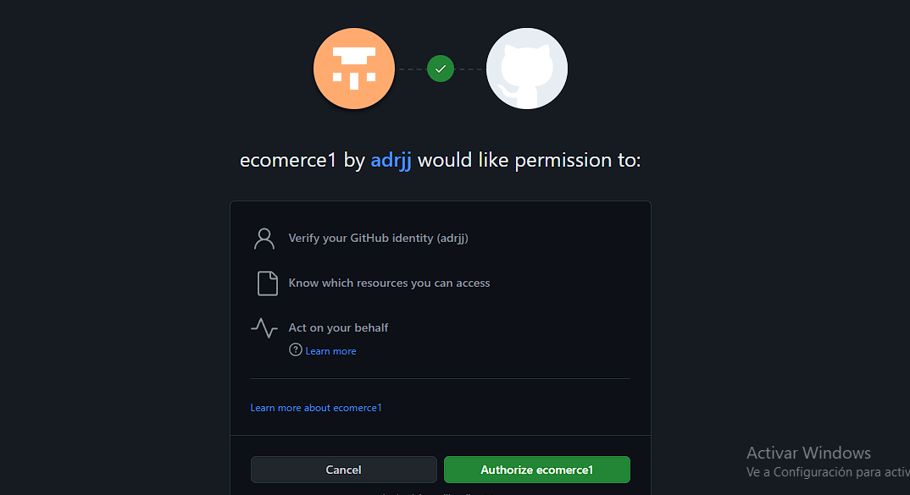

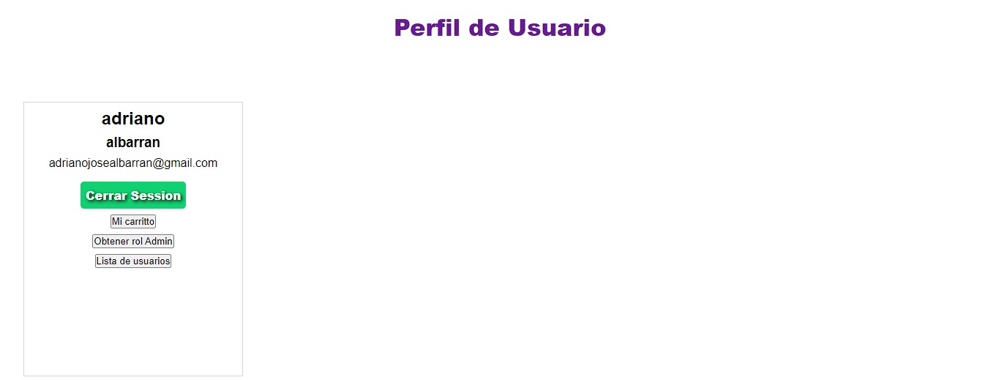

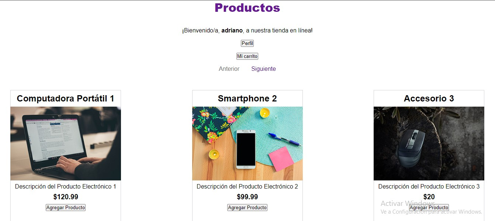

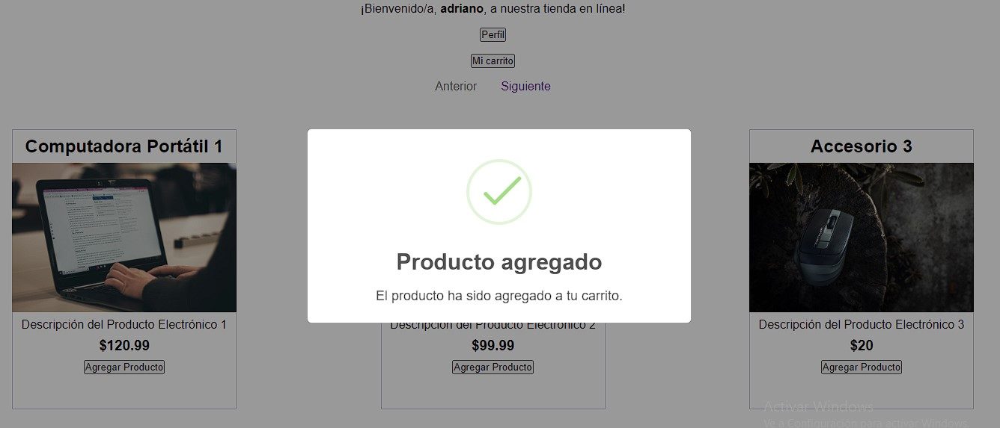

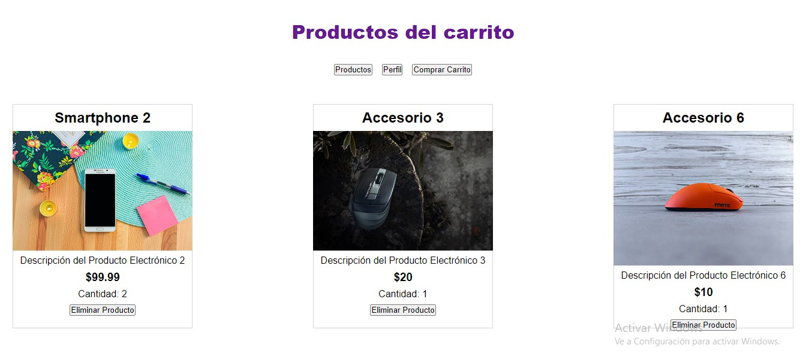

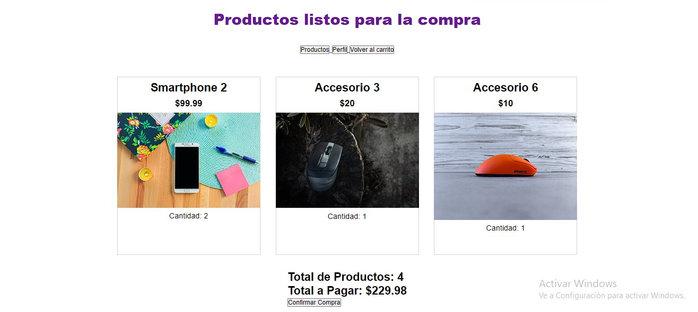

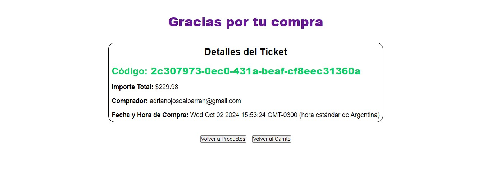

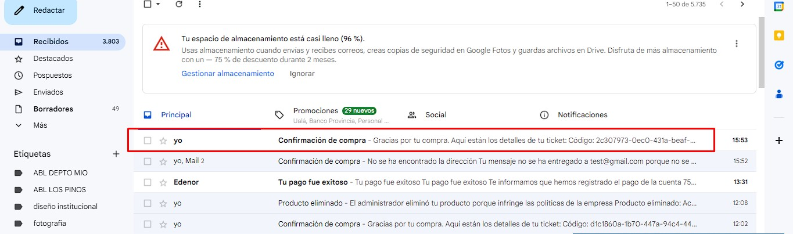

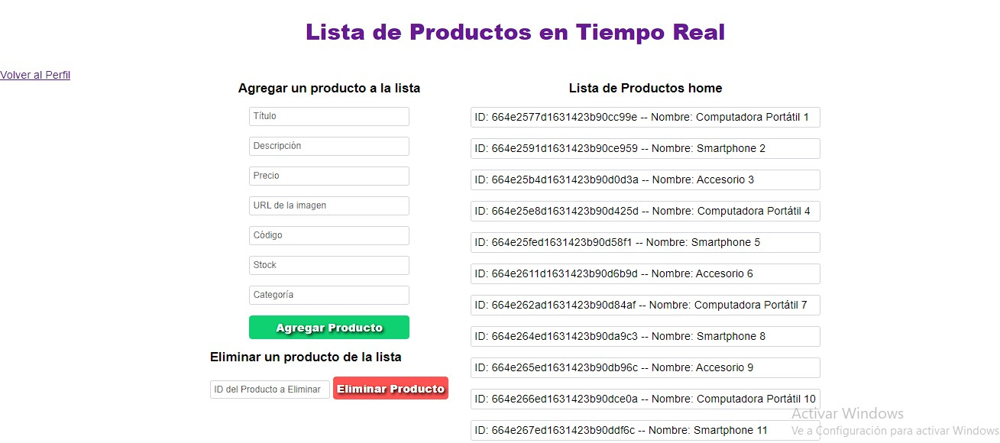

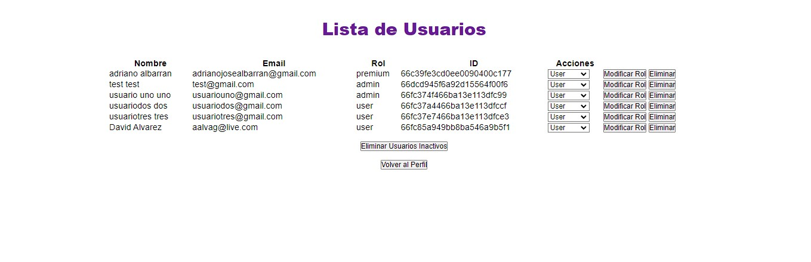

