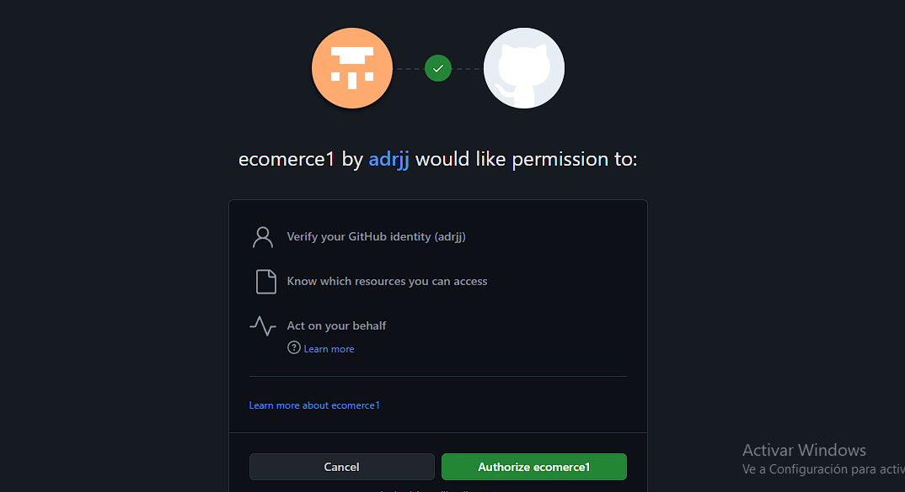
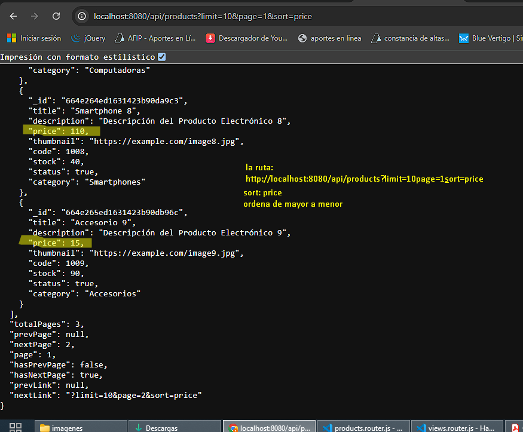
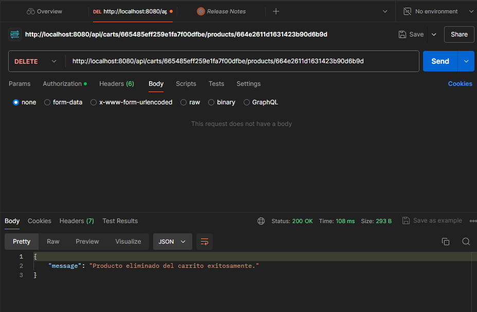

En este proyecto se utilizo de la biblioteca de node.js

    "bcrypt": "^5.1.1",
    "connect-mongo": "^5.1.0",
    "dotenv": "^16.4.5",
    "express": "^4.19.2",
    "express-handlebars": "^7.1.2",
    "express-session": "^1.18.0",
    "handlebars": "^4.7.8",
    "mongodb": "^6.6.2",
    "mongoose": "^8.3.5",
    "mongoose-paginate-v2": "^1.8.1",
    "nodemailer": "^6.9.14",
    "passport": "^0.7.0",
    "passport-github2": "^0.1.12",
    "passport-local": "^1.0.0",
    "socket.io": "^4.7.5",
    "sweetalert2": "^11.11.0",
    "uuid": "^10.0.0"
    "@faker-js/faker": "^8.4.1",
    

Este proyecto tiene la base de un ECOMERCE el paso mas importante es que esta conectado todo con la
base de datos de MONGO db Atlas

Cunentas con varias rutas
api/products  (se maneja dede postman)
api/carts (se maneja dede postman)

Chat interno 
/chat (vista con handlebars)

Carga de productos y eliminacion de los mismos por el ID
/realtimeProducts (vista con handlebars)

Visualizacion de todos los productos cargados en la base de datos
/home (vista con handlebars) 

inicio de sesion usuarios
api/session/login

Registro de usuarios
api/session/register

Datos del perfil
api/session/profile

Carrito del usuario
api/cart

actualización para la Tercera preentrega.
Ya podemos procesar la finalizacion de la compra emitiendo un ticket con los detalles y enviando
este ticket Via mail...

------------------- PERFILE DE USUARIO Y REGISTRO --------------------------
CARRITO DEL USUARIO (UNICO POR CADA USUARIO REGISTRADO)

PERFIL DE USUARIO CON LINK AL CARRITO DE COMPRA

INICIO DE SESION CON GITHUB

INICIO DE SESION

REGISTRO DE USUARIOS

PERFIL

VISTA ADMIN: se lo redigige a /realtimeproducts

VISTA USUARIO COMUN: se lo redirige a /products

--------------------------  PAGINADOS --------------

PRODUCTOS PAGINADOS.

PRODUCTOS DENTRO DEL CARRITO CON
URL:http://localhost:8080/cart/6654a391db46bd58f8df45e3

------------------------- FILTROS ----------------------------

--------------------- CART ---------------------------------

---------------Manejo De Errrores-----------------------------

